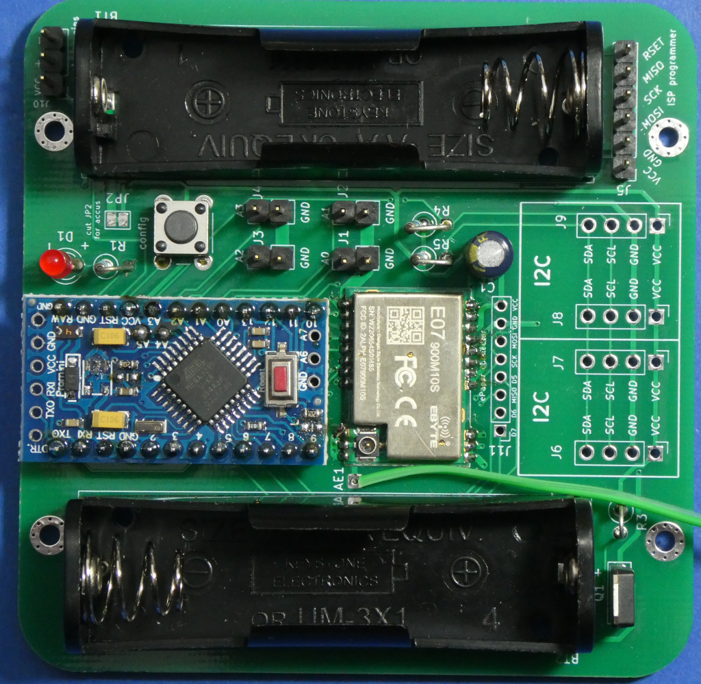
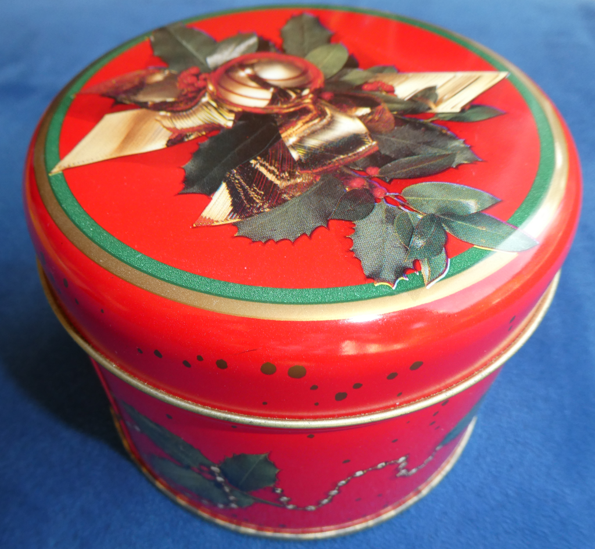
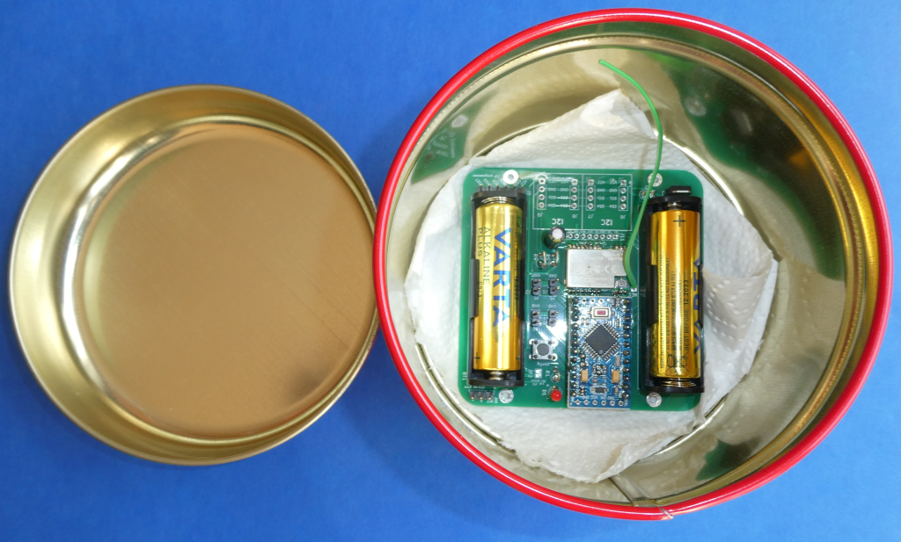
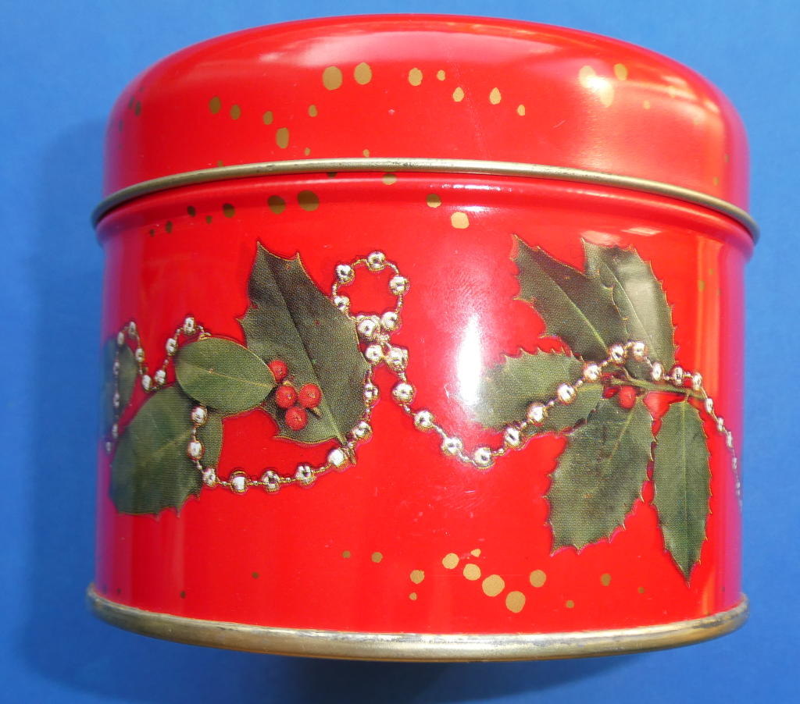
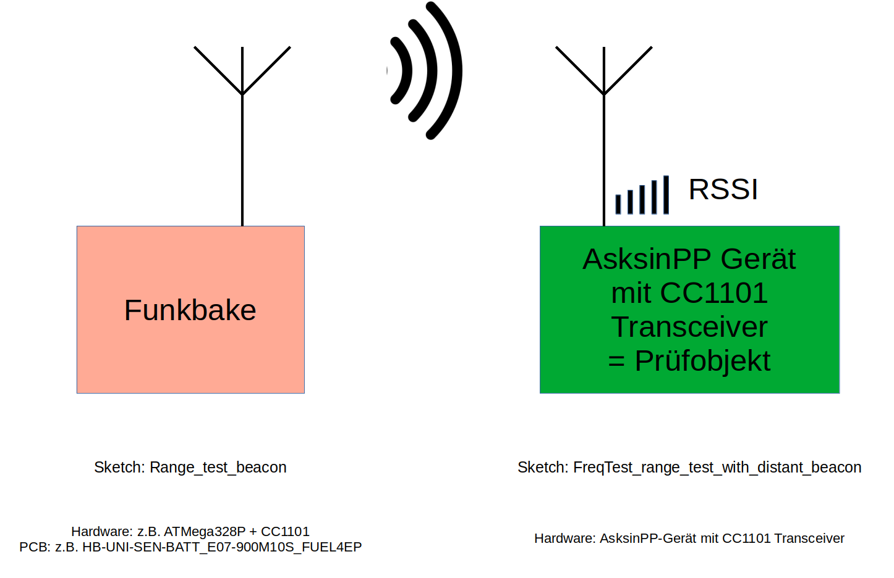

# Range_test_beacon   
 

# 868,3 MHz Funkbake für die Evaluierung der Reichweite einer Hochfrequenzübertragungsstrecke

- Funkbaken-Sketch der alle MSG_INTERVAL (siehe #define im Sketch) Sekunden eine Dummy-Nachricht als Broadcast versendet
- abgeleitet aus HM-WDS40-TH-I-SHT10, mein Dank dafür geht an jpsdl112
- als Hardwarebasis kann jede Platine mit einem Arduino Pro Mini und einem CC1101 Funkmodul für 868,3 MHz dienen z.B. [HB-UNI-SEN-BATT_E07-900M10S_FUEL4EP](https://github.com/FUEL4EP/HomeAutomation/tree/master/AsksinPP_developments/PCBs/HB-UNI-SEN-BATT_E07-900M10S_FUEL4EP):

-	als Geräte-ID wird '0x77 0x77 0x77' verwendet
-	als Gerätename wird 'BEACON0001' verwendet
-	es wird kein I2C Sensor benötigt, da Dummy-Telegramme erzeugt werden
-	der Frequenztest sollte für das verwendete Funkmodul gelaufen sein
-	für die Bildung einer Hochfrequenzfunkübertragungsstecke wird der Empfänger-Sketch [FreqTest_range_test_with_distant_beacon](https://github.com/FUEL4EP/HomeAutomation/tree/master/AsksinPP_developments/sketches/FreqTest_range_test_with_distant_beacon) benötigt
-	die Funkbake kann für eine zusätzliche Hochfrequenzdämpfung in eine dicht schließende Metalldose gesetzt werden, dabei auf elektrische Isolation achten!

-	durch Wahl eines geeigneten räumlichen Abstands und Ortes kann die Hochfrequenzfunkübertragungsstecke bei verschiedenen Dämpfungswerten ausgemessen werden. Die Empfangsreichweite eines RF-Tranceivers kann folgendermaßen ermittelt werden: Die Funkbake wird solange weiter entfernt von dem RF-Tranceivers unter Test entfernt aufgestellt, bis der Empfang von Funksignalen gerade noch möglich ist. Dazu den Sketch [FreqTest_range_test_with_distant_beacon](https://github.com/FUEL4EP/HomeAutomation/tree/master/AsksinPP_developments/sketches/FreqTest_range_test_with_distant_beacon) verwenden:

## Speicherbedarf auf einem ATMega328P Arduino Pro Mini

- Der Sketch verwendet 17890 Bytes (58%) des Programmspeicherplatzes. Das Maximum sind 30720 Bytes.
Globale Variablen verwenden 632 Bytes (30%) des dynamischen Speichers, 1416 Bytes für lokale Variablen verbleiben. Das Maximum sind 2048 Bytes.

## Haftungsausschluss

- die Nutzung der hier veröffentlichten Inhalte erfolgt vollständig auf eigenes Risiko und ohne jede Gewähr
- die nationalen Richtlinien für Funkbetrieb sind vom Anwender unbedingt zu beachten

## Lizenz 

**Creative Commons BY-NC-SA** 
Give Credit, NonCommercial, ShareAlike

 This work is licensed under a <a rel="license" href="http://creativecommons.org/licenses/by-nc-sa/4.0/">Creative Commons Attribution-NonCommercial-ShareAlike 4.0 International License</a>.

-EOF

